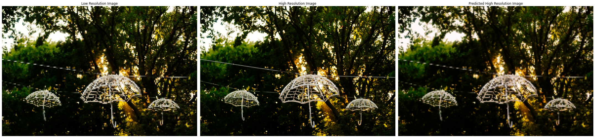
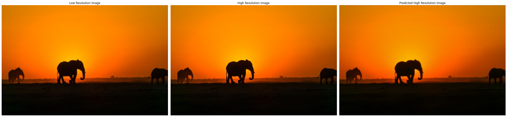
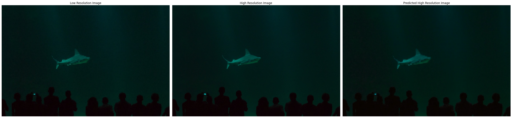

# Image-Super-Resolution-using-Autoencoder-ML-course
Image Super Resolution using Autoencoder implemented in PyTorch, enhancing the resolution of images from a low-resolution input to high-resolution output. This project includes training on a specialized dataset, visualizing reconstructed outputs, and evaluating performance with learning curves and sample comparisons.

This project implements an **Image Super Resolution** technique using **Autoencoders** in PyTorch. The model is designed to enhance low-resolution images to high-resolution versions. The dataset is preprocessed and trained to produce visually improved results while maintaining computational efficiency.

---

## Results
Here are some examples of the results generated by the model:

- **Input (Low-Resolution)** vs. **Ground Truth** vs. **Reconstructed (High-Resolution)**:
  
  
  
  
